These diagrams explain implemented `v1alpha1` behavior. Each diagram is paired with text so the relationship is available when Mermaid cannot render.

## High-level system architecture

The CLI composes deterministic core contracts with persistence, runtime execution, concrete providers, protocols, and optional tracing.

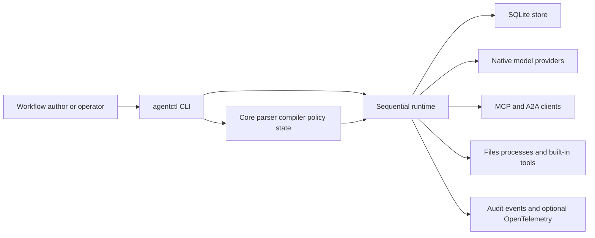

The core owns the graph and rules. Concrete I/O stays at the runtime boundary. SQLite is local durable state, not a distributed service.

## Workflow compilation

Compilation turns one strict document into a versioned deterministic plan before execution begins.

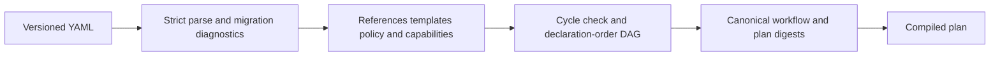

Unknown fields, cycles, missing references, invalid templates, and unsupported provider capabilities fail before a run performs effects.

## Run lifecycle

A normal run moves through durable states and ends in one terminal result or a durable pause.

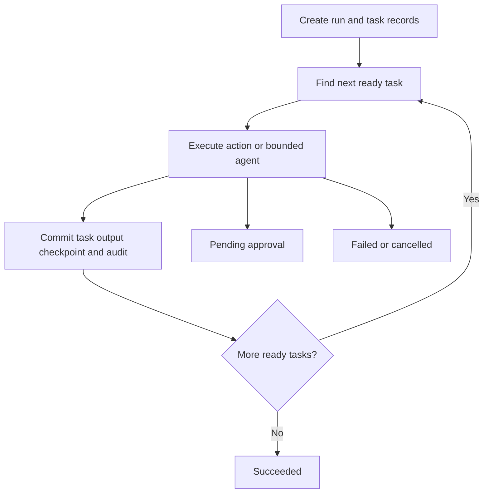

The current scheduler runs one ready task at a time in declaration order. A pending approval is non-terminal and can later resume.

## Runtime state machine

Run and task transitions are validated instead of being inferred from missing records.

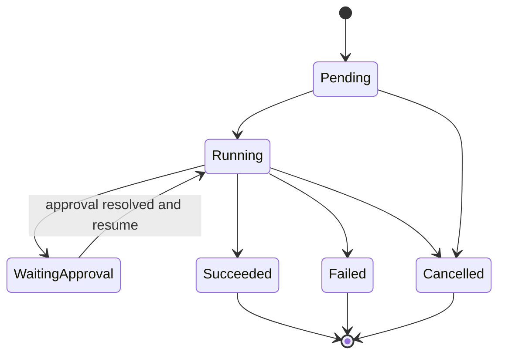

Invalid transitions fail explicitly. Replay requires a terminal source; resume requires a safe non-terminal source.

## Effect recording

Every non-pure operation is requested durably before an executor starts.

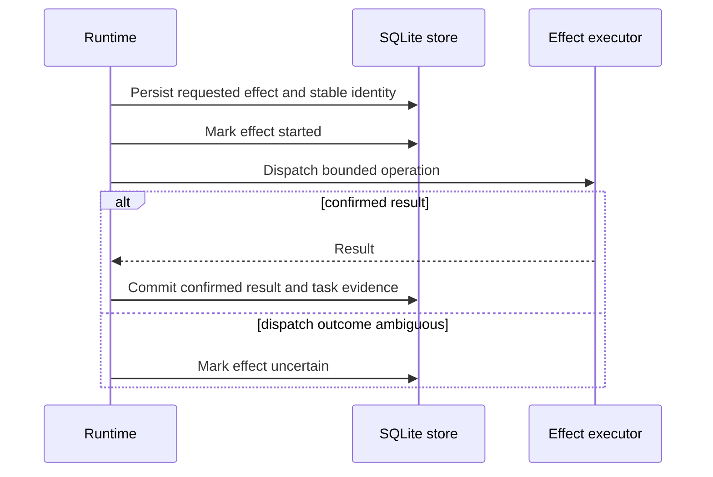

A request-before-start ledger supports reuse of confirmed results. It does not prove exactly-once behavior in an external system.

## Resume flow

Resume continues the same non-terminal run only when durable evidence makes continuation safe.

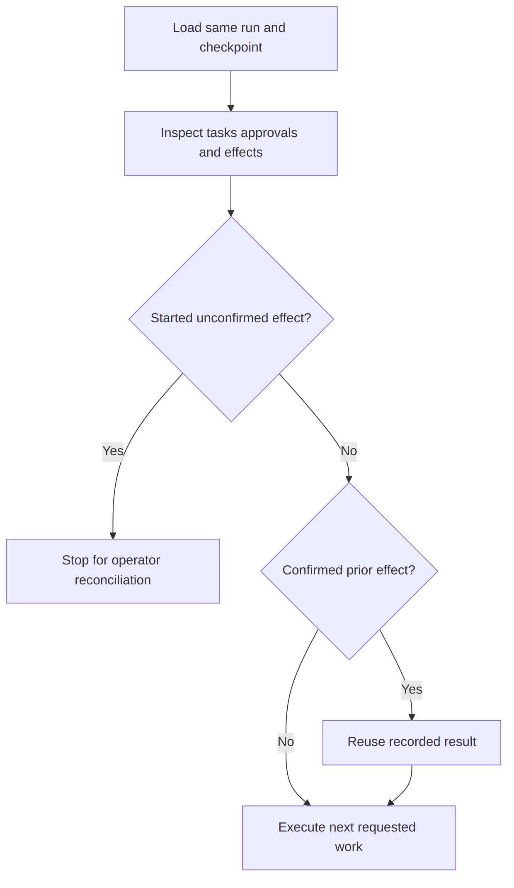

Resume preserves the run identity and progress. It never silently repeats an uncertain external effect.

## Recorded replay flow

Recorded replay constructs a new linked record entirely from terminal stored evidence.

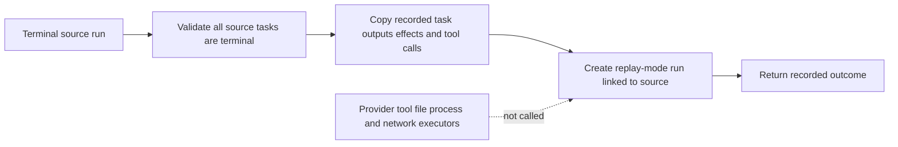

Replay reports historical truth. It does not observe current files, rerun verification, or contact a provider.

## Fork or rerun flow

Fork makes fresh execution an explicit choice instead of overloading replay.

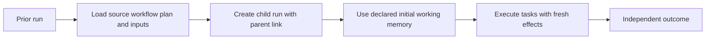

Fork may repeat external mutations and may produce a different result. Reconcile uncertain source effects before forking.

## Approval lifecycle

Policy can stop an effect before dispatch and require an operator-controlled decision.

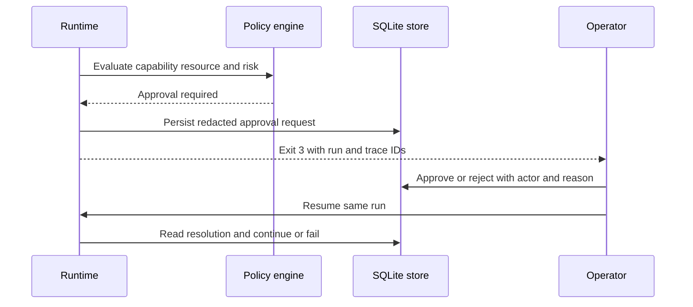

Non-interactive execution never waits on stdin or auto-approves. The platform authenticates the operator.

## Container deployment

The production image is a non-root CLI with four explicit host-managed mounts.

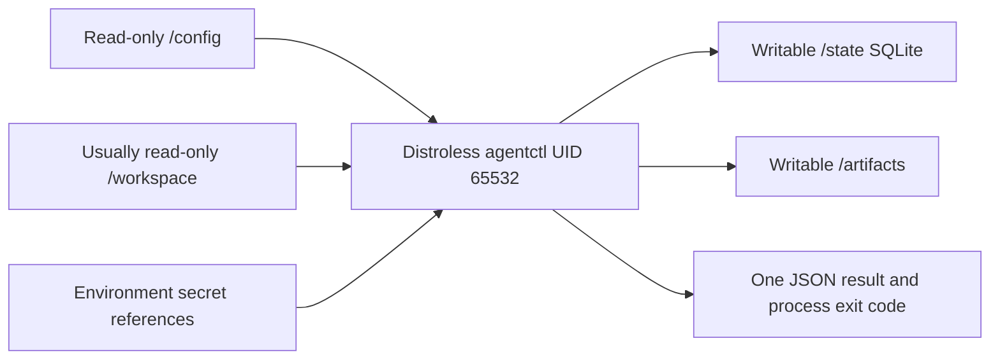

The root filesystem can remain read-only. State must persist for inspection, approval, resume, and replay.

## CI/CD execution

CI remains the outer scheduler and artifact system.

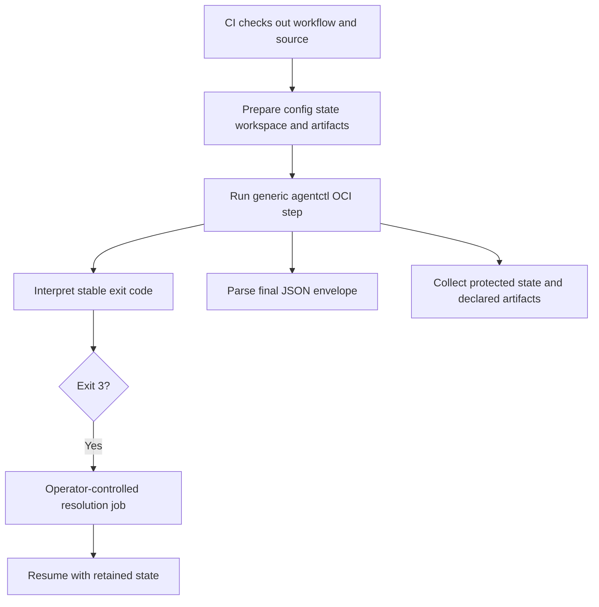

GitHub Actions, GitLab CI, Jenkins, Harness CI, and Kubernetes use the same mount and process contract.

## Provider and tool interaction

The runtime, not the model, owns tool visibility, policy, validation, and effect recording.

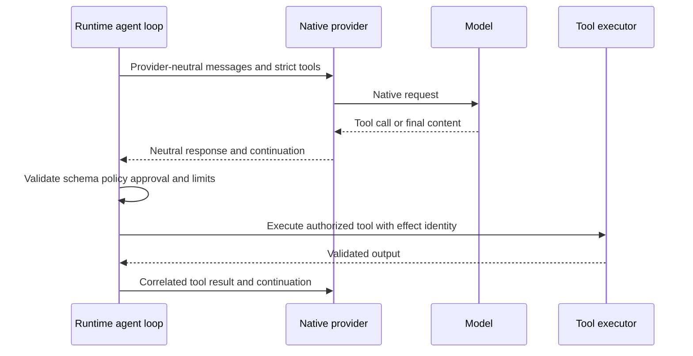

Provider-native types stop at the adapter. Model output cannot change policy or tool metadata.

## MCP and A2A boundaries

Both protocols are remote effects with pinned versions, explicit hosts, environment-backed headers, and conservative ambiguity handling.

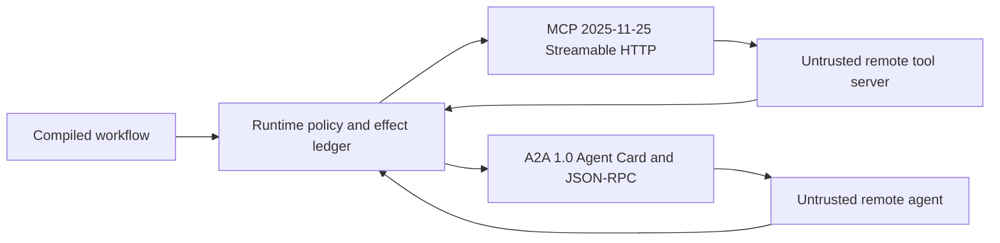

MCP annotations and A2A cards are untrusted metadata. The clients do not automatically reconnect or resubmit after an ambiguous operation.

## Crate dependency map

The dependency direction keeps deterministic contracts independent from adapters.

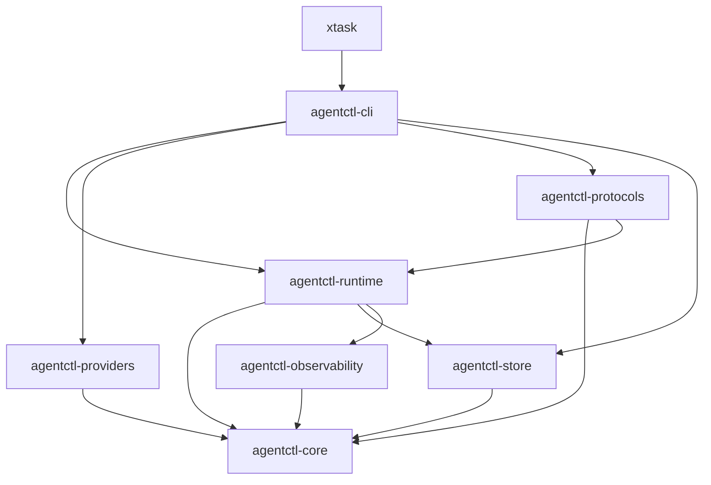

`agentctl-core` has no dependency on HTTP, SQLite, CLI parsing, or concrete executor types. `xtask` drives the built CLI for generation and acceptance.
> Canonical source: [`docs/architecture/DIAGRAMS.md`](https://github.com/opensourceops/agentctl/blob/main/docs/architecture/DIAGRAMS.md). Verified against agentctl commit `a1ebcadcc2557136cb82633862c50854223981fa`.
