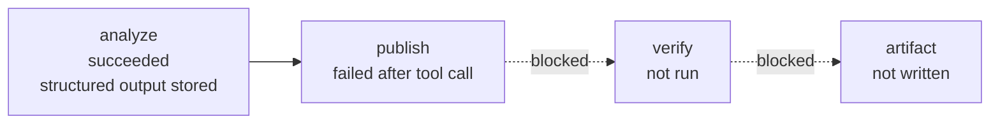
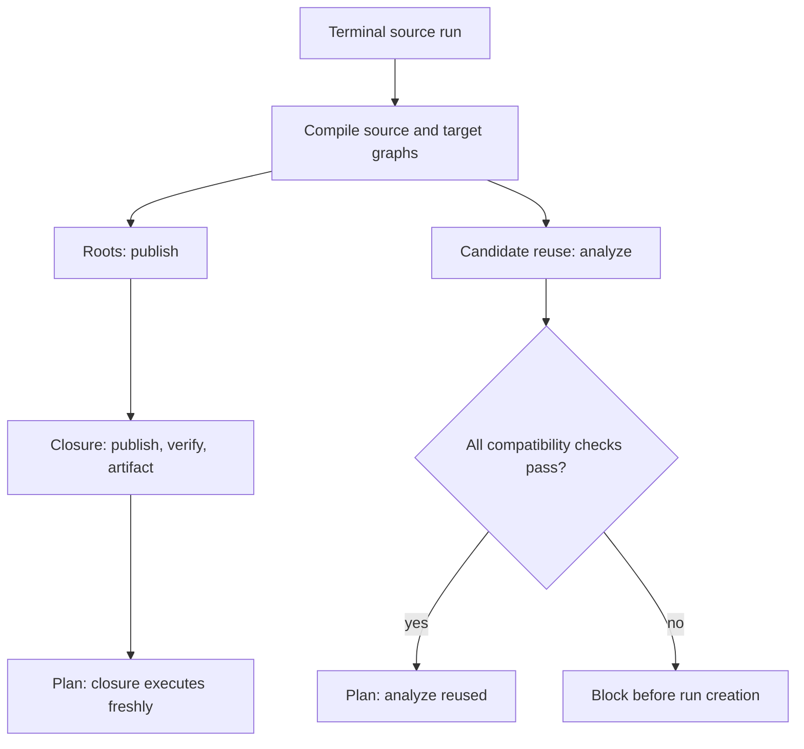
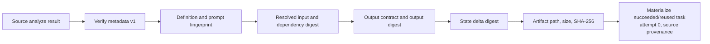
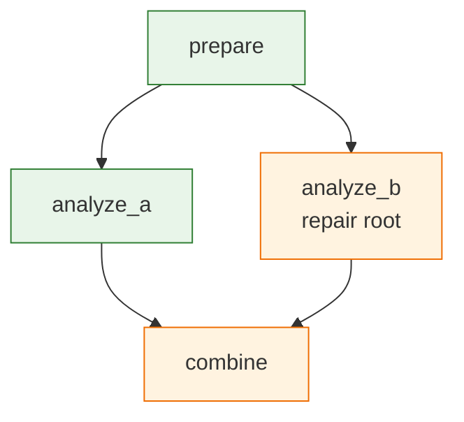
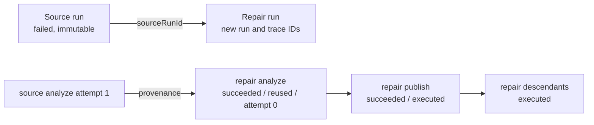
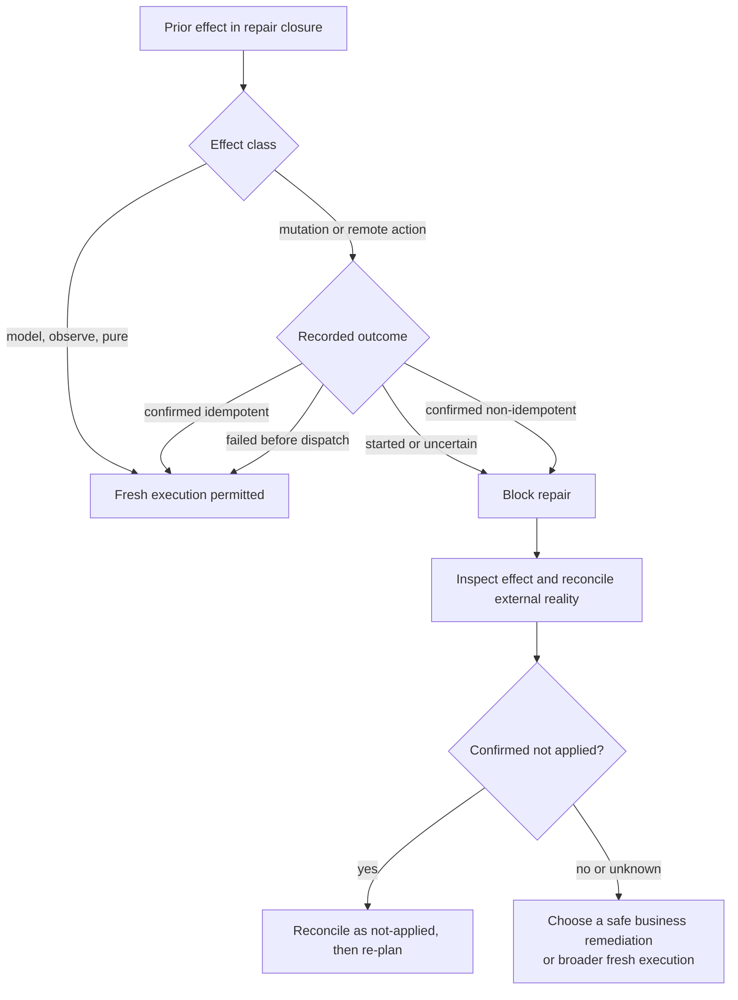

Suppose `analyze` and `publish` are agent tasks. `analyze` succeeded and stored validated JSON. `publish` called its read-only tool but failed because its turn limit was too small. You corrected only `publish`.

Do not resume the failed terminal run. Resume continues the same non-terminal run with the same compiled definition. Do not replay it to execute the fix. Recorded replay copies terminal recorded results and emits no fresh effects. Use repair to create a linked run that reuses compatible `analyze` data and executes `publish` plus its descendants from the corrected workflow.

The runnable example is in [`examples/selective-repair-openai/`](https://github.com/opensourceops/agentctl/blob/9640102855bc513e2849d0a08344c1f13e50028a/examples/selective-repair-openai/README.md).

## 1. Understand the failed source



Inspect the failed run:

```bash
agentctl inspect SOURCE_RUN_ID \
  --db .agentctl/runtime.db \
  --output json \
  --color never
```

Confirm that the source is terminal, `analyze` is `succeeded`, `publish` is `failed`, and any partial effects are understood.

## 2. Fix task 2 and plan

Increase the turn limit or correct the task instructions, prompt file, tool configuration, implementation, timeout, or output contract in the target workflow. Then plan without calling a provider or tool:

```bash
agentctl repair repaired.workflow.yaml SOURCE_RUN_ID \
  --from publish \
  --plan \
  --db .agentctl/runtime.db \
  --output json \
  --color never
```



The plan reports source and target workflow digests, roots, reused and rerun tasks, new/removed/changed tasks, blocked checks, estimated provider tasks, fresh effects, and possible approvals. A compatible plan exits `0`. A blocked plan is still valid JSON and exits `3`.

For independent failed branches, repeat the root:

```bash
agentctl repair workflow.yaml SOURCE_RUN_ID \
  --from analyze_a \
  --from analyze_b \
  --plan
```

A source task that already succeeded can be a fresh root only with `--restart-successful`.

## 3. How upstream reuse works



The runtime starts from target initial memory, visits reusable tasks in deterministic topological order, materializes their outputs, and applies only their committed successful state deltas. It does not copy the source run's final memory snapshot. Failed task-local state and invalidated downstream state are excluded.

Agent tasks that feed downstream tasks need an explicit structured output contract through agent `structuredOutput` or task `outputSchema`. Built-in actions use their runtime-owned JSON output contract when a more specific schema is not needed. Outputs are validated at completion and again before reuse.

## 4. Downstream invalidation



Every root and transitive descendant executes. Tasks outside that union are candidates for reuse, not automatically reusable. A new descendant executes. A new unrelated task blocks and asks for another or earlier root. A removed unreferenced task is reported but does not block.

## 5. Execute and inspect

```bash
agentctl repair repaired.workflow.yaml SOURCE_RUN_ID \
  --from publish \
  --reason "raise publish turn limit after read-only call" \
  --db .agentctl/runtime.db \
  --output json \
  --color never
```



The result includes the new repair run ID, source run ID, trace ID, reused tasks, executed tasks, final state, and workflow outputs. `inspect` exposes run lineage and each task's disposition, source attempt, fingerprints, output/state/artifact digests, and reuse decision. Reused tasks create no provider session, tool call, process, network call, or effect row in the repair run.

The repair run materializes reused task output and state metadata in its own rows. Deleting the source database rows later does not break repair inspection or recorded replay. Artifact bytes must remain in the configured durable workspace and are verified before reuse.

## 6. Understand fresh-effect safety



List effects for the failed boundary, then inspect the selected effect:

```bash
agentctl effects --db .agentctl/runtime.db list SOURCE_RUN_ID --task publish
agentctl effects --db .agentctl/runtime.db inspect EFFECT_ID
```

If an effect is `started` or `uncertain` and an operator has verified that it did not happen:

```bash
agentctl effects --db .agentctl/runtime.db reconcile EFFECT_ID \
  --status not-applied \
  --reason "remote system confirms no record" \
  --actor operator-name
```

Use `--status applied --result-file result.json` when the effect happened and resume needs its externally confirmed result. Use `--status compensated --compensation-effect EFFECT_ID` only after a distinct compensation effect is confirmed. There is no generic force option and no exactly-once claim. An applied non-idempotent effect stays blocked from duplicate fresh execution until it has a valid compensation record. Normal policy, approval, timeout, retry, and cancellation behavior applies to every fresh task. See [Effect reconciliation](https://github.com/opensourceops/agentctl/blob/9640102855bc513e2849d0a08344c1f13e50028a/docs/guides/EFFECT_RECONCILIATION.md).

A repaired agent begins a new provider session. It receives target instructions
and tools plus validated upstream output and reconstructed memory. It never
receives the failed source task's `previous_response_id`, stateless
continuation items, incomplete turn, pending call, or reasoning state. Within
the new repaired task, normal multi-turn continuation still applies.

## 7. Replay the repaired result offline

After a successful repair:

```bash
env -u OPENAI_API_KEY agentctl replay REPAIR_RUN_ID \
  --db .agentctl/runtime.db \
  --output json \
  --color never
```

Recorded replay has a new replay run ID but the same semantic outputs. It dispatches zero fresh effects and does not rewrite artifacts.

## Troubleshooting blocked plans

| Block | Meaning | Next action |
| --- | --- | --- |
| `repair_root_missing` | The root is absent from the target graph. | Correct the task ID or workflow. |
| `successful_root_requires_acknowledgement` | The selected root succeeded. | Add `--restart-successful` only when fresh execution is intended. |
| `definition_fingerprint_mismatch` | A task changed outside the rerun closure. | Choose that task as an earlier/additional root. |
| `dependency_set_mismatch` | A reusable task has different upstream dependencies. | Select the changed consumer as another repair root. |
| `resolved_input_digest_mismatch` | Inputs, dependency output, or boundary memory changed. | Choose the first affected task as a root. |
| `missing_output_contract` | A reused agent feeds downstream work without typed output. | Add structured output and create a fresh source result. |
| `output_contract_mismatch` | The target expects a different contract. | Rerun from the producer. |
| `output_digest_mismatch` | Persisted output was modified or corrupted. | Do not reuse it; rerun from the producer. |
| `state_delta_missing` or `state_delta_invalid` | Successful boundary-state metadata is absent or corrupt. | Select the task as an earlier root; do not edit the database. |
| `artifact_integrity` | A content-addressed artifact is missing or corrupt. The block reports its logical path, expected digest, and expected size. | Restore the database and sibling CAS from a consistent backup, or select its producer as an earlier repair root. |
| `unresolved_reused_effect` | A nominally successful reusable task retains a started or uncertain effect. | Reconcile external reality before reuse. |
| `legacy_task_metadata` | The source predates repair metadata v1. | Run `agentctl runs analyze` and `runs upgrade`, then use the reported safe root. |
| `new_task_outside_repair_closure` | A new unrelated task has no result. | Add it as a root or choose an earlier common boundary. |
| `unreconciled_effect` | Fresh execution may duplicate a mutation. | Inspect and reconcile external reality first. |

Use [`agentctl retry`](https://github.com/opensourceops/agentctl/blob/9640102855bc513e2849d0a08344c1f13e50028a/docs/guides/TERMINAL_RETRY.md) instead when the workflow definition is unchanged and the intent is to rerun failed or explicitly selected boundaries of a terminal source. Use repair for a corrected definition and fork for a broader intentionally fresh execution.
