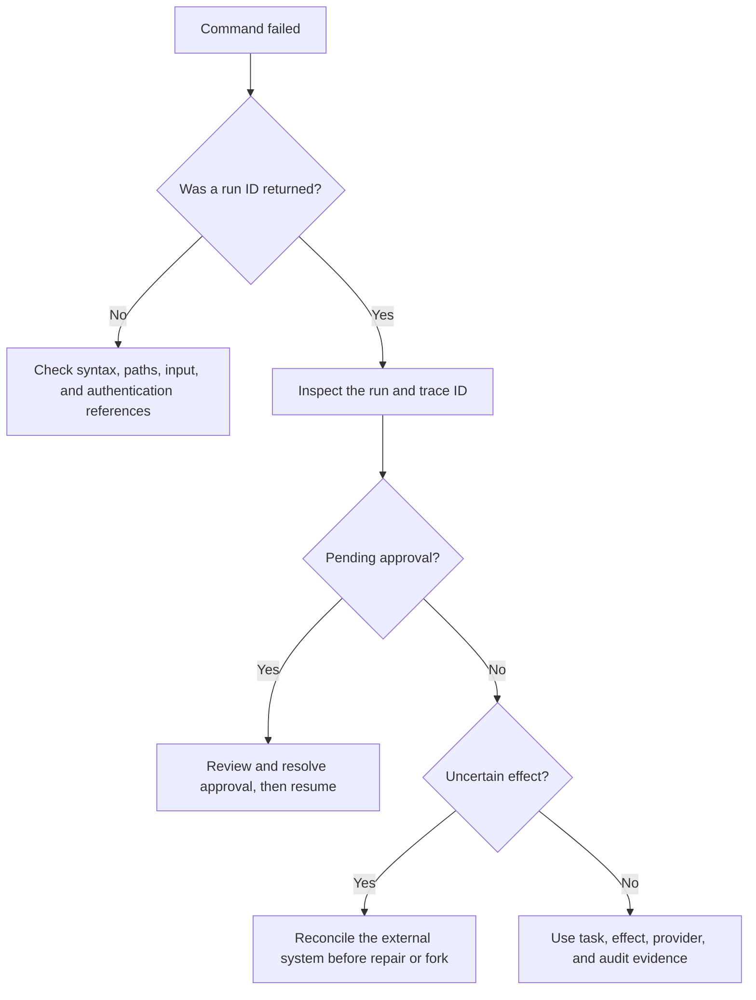

Start with the exit code, then inspect the versioned error envelope and durable run state. Do not share provider credentials, complete databases, private prompts, or confidential artifacts in a public issue.

## Decision path



The path separates pre-run validation from durable runtime failures. An uncertain effect always requires external reconciliation.

## Validation error, exit 2

**Symptom:** `check`, `plan`, or `run` reports invalid YAML, a missing reference, unsupported capability, or bad template.

**Likely cause:** The strict workflow API v1 schema rejected a field or the
compiler could not prove the graph and capabilities.

**Diagnose:**

```text
agentctl check workflow.yaml --output json --color never
agentctl schema --write /tmp/workflow.schema.json --output json --color never
```

**Expected evidence:** A source-aware diagnostic with a code and field location.

**Resolve:** Fix the document instead of suppressing the diagnostic. Validate again before running.

## Provider authentication failure

**Symptom:** Exit `6` reports an unavailable secret reference or authentication response.

**Likely cause:** The workflow names an absent environment value, unavailable
or denied file/process source, or the provider rejected the resolved
credential.

**Diagnose:**

```text
agentctl auth check workflow.yaml --output json --color never
agentctl providers inspect workflow.yaml --output json --color never
```

**Expected evidence:** The safe source description and provider capability,
never the secret value. Process references report `unchecked` and are not
executed by diagnostics.

**Resolve:** Inject the named environment value, mount the file under an allowed
root, or repair the process policy/helper. Do not add a key to YAML or a command
argument.

## Provider capability mismatch

**Symptom:** Compilation rejects structured output, tools, reasoning, prompt cache, continuation, or a usage limit.

**Likely cause:** The selected provider does not declare the requested feature, or an option is invalid.

**Diagnose:** Run `providers inspect` and compare the [provider matrix](/agentctl/providers/).

**Resolve:** Remove the unsupported request, choose a capable provider, or change the workflow design. Do not assume provider APIs are interchangeable.

## Tool failure or policy denial

**Symptom:** Exit `3` or `4`, with a denied capability, invalid tool input/output, path error, host denial, or process denial.

**Diagnose:**

```text
agentctl inspect RUN_ID --db .agentctl/runtime.db --output json --color never
```

**Expected evidence:** Tool ID, capability, effect risk, policy decision, and redacted input.

**Resolve:** Correct the schema or implementation. Expand a policy grant only after reviewing the exact resource and risk.

## Pending approval

**Symptom:** A non-interactive run exits `3` and state is paused.

**Diagnose:** `agentctl approvals list RUN_ID --db PATH`.

**Resolve:** Review the proposed effect. Approve or reject it with an actor and reason, then resume the same run and database.

## Database locked or persistence error

**Symptom:** Exit `5` reports a SQLite open, lock, corruption, or future-schema error.

**Likely cause:** Wrong permissions, a read-only mount, lock contention beyond the five-second busy timeout, damaged files, or a newer schema.

**Diagnose:**

```text
agentctl db stats --db /state/runtime.db --output json --color never
ls -ld /state /state/runtime.db
```

**Expected evidence:** A readable and writable state directory owned by the runtime UID. A newer schema is reported explicitly.

**Resolve:** Correct ownership and mounts, serialize conflicting maintenance, restore a consistent backup, or use a compatible binary. Never edit SQLite tables by hand as a first response.

## Resume or replay failure

**Symptom:** Resume rejects a terminal run or unresolved effect, or replay rejects a non-terminal source.

**Diagnose:** Inspect the source run, tasks, effects, and approvals.

**Resolve:** Resume only a safe non-terminal run. Replay only a terminal run. Reconcile uncertain external state before an explicit fork.

## Repair plan blocked

**Symptom:** `repair --plan` emits a valid `RepairPlan` with `compatible: false` and exits `3`.

**Diagnose:**

```text
agentctl repair target.yaml SOURCE_RUN_ID --from TASK --plan \
  --db .agentctl/runtime.db --output json --color never
agentctl effects --db .agentctl/runtime.db inspect SOURCE_RUN_ID --task TASK
```

**Expected evidence:** Each `blockedReuse` item names the task, compatibility rule, safe source/target fingerprints, suggested root, and whether a full fork is required.

**Resolve:** Choose the earliest changed/incompatible producer as another repair root, restore the exact verified artifact, add a structured output contract and create a fresh source result, or reconcile an uncertain effect only after checking external reality. Do not edit task rows or use fork as a generic force option. See [Repair a failed workflow](/agentctl/guides/selective-repair/).

## Container permission or read-only failure

**Symptom:** The image cannot create `/state/runtime.db` or write `/artifacts`.

**Likely cause:** Host directories are not writable by UID/GID 65532 or the writable mounts are missing.

**Resolve:** Provision and mount `/state` and `/artifacts` with appropriate ownership. Keep the root filesystem read-only and use `/tmp` as a small `noexec,nosuid` tmpfs.

## Podman machine or forwarding unavailable

**Symptom:** `podman info` reports connection refused even though Podman is
installed, or `cargo xtask acceptance-container` cannot reach the engine.

**Diagnose:**

```text
podman machine list
podman system connection list
podman machine start podman-machine-default
podman info
```

**Expected evidence:** The existing machine is running and the configured
forwarded socket answers `podman info`.

**Resolve:** Start the existing machine without deleting or recreating it. Some
macOS command harnesses terminate libkrun and `gvproxy` children when the
starting shell exits; keep that terminal open and probe from another terminal.
If `machine stop` reports a stale `gvproxy` PID, first prove the recorded PID
does not exist, move only that temporary PID file aside, stop cleanly, and
start again. Do not delete the machine, images, or connection configuration
and do not weaken TLS to make the probe pass.

## Corporate CA failure

**Symptom:** The image build cannot verify the intercepted dependency-network certificate.

**Resolve:** Pass a reviewed CA bundle through BuildKit secret `agentctl_ca` or `AGENTCTL_BUILD_CA_FILE` for the acceptance wrapper. Never disable TLS verification or commit the certificate.

## Windows path issue

**Symptom:** A workspace or database path parses differently from a Unix example.

**Resolve:** Use native absolute paths and quote paths with spaces. Windows
cannot express Unix database mode bits, so rely on the user profile ACL. The
exact-head hosted Windows verification, acceptance, completeness, and package
gates pass for the source and artifacts you intend to use.

## Safe issue report

Include the exact `agentctl version`, operating system, redacted command, exit code, diagnostic code, workflow API version, minimal non-secret workflow, and relevant run/trace IDs. Share a narrow redacted `inspect` excerpt only when needed. Report security problems through the private process in [Security](/agentctl/security/), not a public issue.

## Doctor reports missing or unverified host prerequisites

Run `agentctl doctor workflow.yaml --workspace . --output json` before dispatch. A missing explicit interpreter or helper file produces `ready: false`. Install the required tool or correct the configured path, then rerun the check.

A bare command such as `python3` is unverified because runtime process environments are cleared; the invoking shell's `PATH` is not proof that dispatch resolves the same executable. Cookbook `setup.py` uses the selected virtual environment's absolute interpreter path and updates the explicit interpreter-basename allowlist before producing `local.workflow.yaml`.

Doctor checks metadata and executable permissions where supported. It does not execute helpers, import Python modules, invoke child Git commands, contact a service, or read secret contents. Transitive dependencies and module availability can remain unverified even when the declared executable is present. Its readiness result covers the reported static checks, not successful runtime handshakes or a passing workflow.
